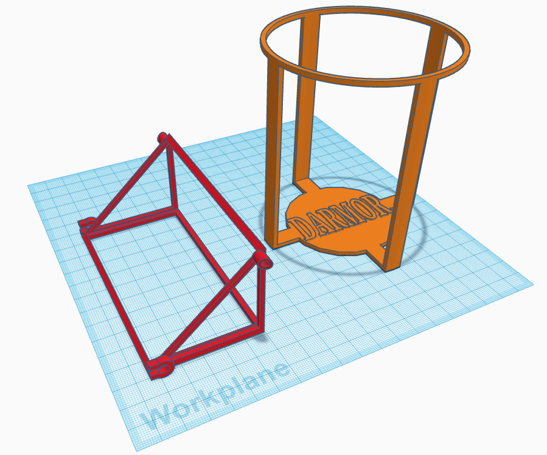

[![Contributors][contributors-shield]][contributors-url]
[![Forks][forks-shield]][forks-url]
[![Stargazers][stars-shield]][stars-url]
[![Issues][issues-shield]][issues-url]
[![MIT License][license-shield]][license-url]
[![LinkedIn][linkedin-shield]][linkedin-url]

<!-- PROJECT LOGO -->
 

  
<h3 align="center">Toyota Corolla Waterbottle Holder</h3>
  

    Traditional cup holders in automotive typically aren't designed for 32oz bottles. This project is to replace the 'coin' drawer with an accessibly, factory-looking design.
     
     
    <a href="https://github.com/DarmorGamz/Corolla-Waterbottle-Holder">View Demo</a>
    ·
    <a href="https://github.com/DarmorGamz/Corolla-Waterbottle-Holder/issues">Report Bug</a>
    ·
    <a href="https://github.com/DarmorGamz/Corolla-Waterbottle-Holder/issues">Request Feature</a>
  

<!-- ABOUT THE PROJECT -->
## About The Project
Components designed in CAD  

(<a href="#readme-top">back to top</a>)

<!-- LICENSE -->
## License
Distributed under the GPL License. See `LICENSE.txt` for more information.

(<a href="#readme-top">back to top</a>)

<!-- CONTACT -->
## Contact

Darren Morrison - darren09@live.ca 

Project Link: [https://github.com/DarmorGamz/Corolla-Waterbottle-Holder](https://github.com/DarmorGamz/Corolla-Waterbottle-Holder)

(<a href="#readme-top">back to top</a>)

<!-- ACKNOWLEDGMENTS -->
## Acknowledgments
Myself

(<a href="#readme-top">back to top</a>)

 
<!-- MARKDOWN LINKS & IMAGES -->
[contributors-shield]: https://img.shields.io/github/contributors/DarmorGamz/Corolla-Waterbottle-Holder.svg?style=for-the-badge
[contributors-url]: https://github.com/DarmorGamz/Corolla-Waterbottle-Holder/graphs/contributors
[forks-shield]: https://img.shields.io/github/forks/DarmorGamz/Corolla-Waterbottle-Holder.svg?style=for-the-badge
[forks-url]: https://github.com/DarmorGamz/Corolla-Waterbottle-Holder/network/members
[stars-shield]: https://img.shields.io/github/stars/DarmorGamz/Corolla-Waterbottle-Holder.svg?style=for-the-badge
[stars-url]: https://github.com/DarmorGamz/Corolla-Waterbottle-Holder/stargazers
[issues-shield]: https://img.shields.io/github/issues/DarmorGamz/Corolla-Waterbottle-Holder.svg?style=for-the-badge
[issues-url]: https://github.com/DarmorGamz/Corolla-Waterbottle-Holder/issues
[license-shield]: https://img.shields.io/github/license/DarmorGamz/Corolla-Waterbottle-Holder.svg?style=for-the-badge
[license-url]: https://github.com/DarmorGamz/Corolla-Waterbottle-Holder/blob/master/LICENSE.txt
[linkedin-shield]: https://img.shields.io/badge/-LinkedIn-black.svg?style=for-the-badge&logo=linkedin&colorB=555
[linkedin-url]: https://linkedin.com/in/darren--morrison